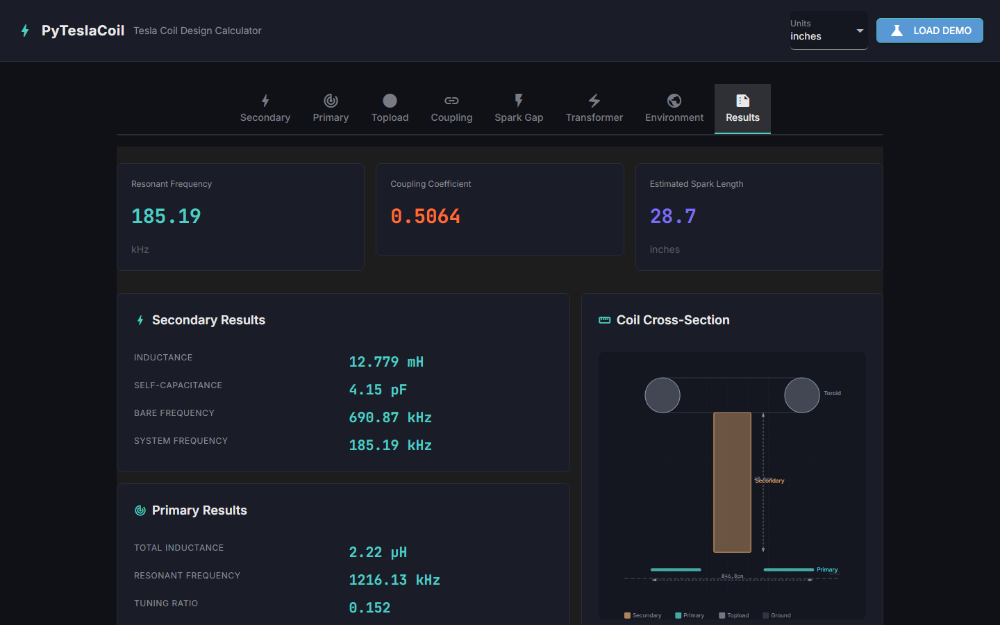
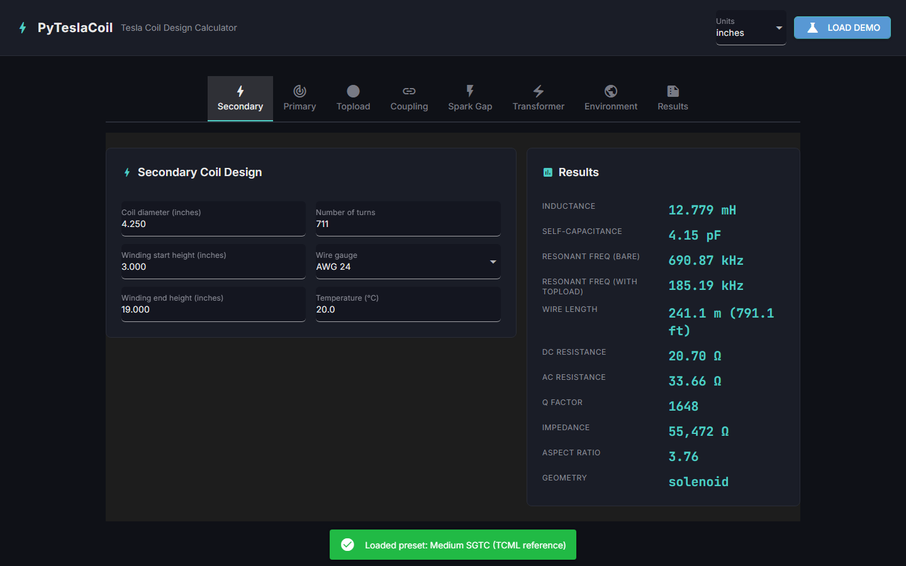
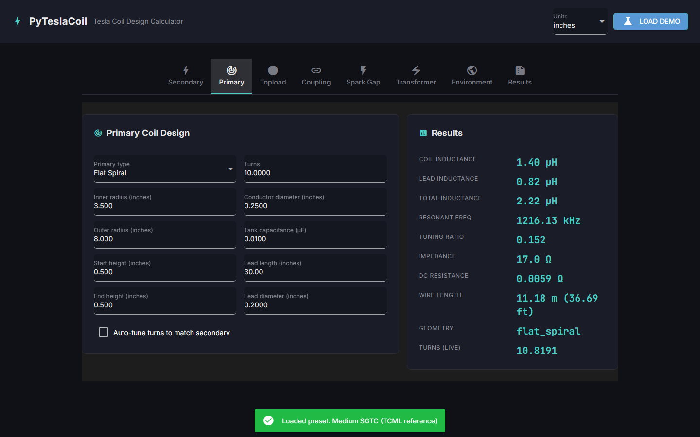
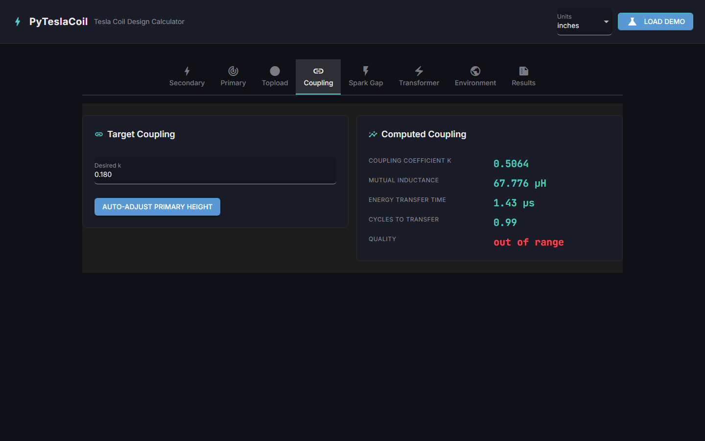
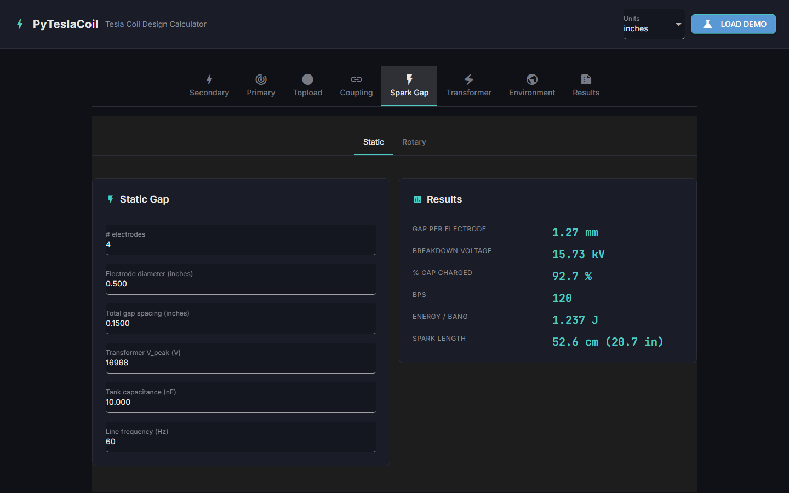

# PyTeslaCoil
[](https://opensource.org/licenses/MIT)
[](https://www.python.org/downloads/)
[]()

An open-source Tesla coil design calculator — the modern Python replacement for JavaTC, featuring a pure-Python physics engine, Pydantic v2 models, and a NiceGUI web frontend.

<p align="center">
  
</p>

## Table of Contents
- [Overview](#overview)
- [Screenshots](#screenshots)
- [Features](#features)
- [Architecture](#architecture)
- [Installation](#installation)
- [Usage](#usage)
- [Configuration](#configuration)
- [Testing](#testing)
- [Project Structure](#project-structure)
- [Physics Reference](#physics-reference)
- [Acknowledgements](#acknowledgements)

## Overview

PyTeslaCoil is a complete electromagnetic design tool for spark-gap (SGTC) and dual-resonant solid-state (DRSSTC) Tesla coils. It replicates all core features of JavaTC (classictesla.com) — the standard tool in the Tesla coil community since ~2000 — in a modern, all-Python stack with a browser-based UI.

The application computes secondary/primary inductance, self-capacitance, coupling coefficient, resonant frequencies, spark-gap behavior, transformer sizing, and estimated spark length. It can be used as a **standalone library** for scripts and notebooks, or as a **full desktop app** with live-updating calculations and a 2D coil visualizer.

## Screenshots

### Secondary Coil Design
Enter coil geometry, wire gauge, and winding parameters. Results update live as you type.

<p align="center">
  
</p>

### Primary Coil Design
Configure flat spiral, helical, or conical primaries with auto-tune to match secondary frequency.

<p align="center">
  
</p>

### Coupling Analysis
View the computed coupling coefficient with quality indicators. Auto-adjust primary height to hit a target k.

<p align="center">
  
</p>

### Spark Gap Configuration
Static and rotary gap parameters with breakdown voltage, BPS, and energy-per-bang calculations.

<p align="center">
  
</p>

### Results Dashboard
Headline metrics (resonant frequency, coupling, spark length), detailed subsection results, coil cross-section visualizer, and one-click export to text, JSON, or PDF.

<p align="center">
  
</p>

## Features

- **Secondary Coil Design**: Solenoid, conical, and inverse conical geometries with Wheeler inductance and Medhurst self-capacitance
- **Primary Coil Design**: Flat spiral (pancake), helical, and conical primaries with lead inductance correction
- **Topload Capacitance**: Toroid (empirical fit) and sphere (exact analytical) with multi-stage stacking support
- **Coupling Coefficient**: Neumann mutual inductance via complete elliptic integrals (K, E) with NumPy-vectorized O(N_pri x N_sec) filamentary method
- **Auto-Tune**: Automatic primary turns calculation to match secondary resonant frequency via SciPy root-finding (brentq)
- **Static & Rotary Spark Gaps**: Paschen breakdown, BPS, dwell time, cap charge fraction, and energy-per-bang
- **Transformer Sizing**: NST, OBIT, MOT, and pole-pig support with resonant and LTR capacitor recommendations
- **Spark Length Estimation**: Freau empirical formula from input power or BPS x bang energy
- **2D Coil Visualizer**: Proportional SVG cross-section rendering of secondary, primary, topload, and ground plane
- **Export**: JavaTC-style consolidated text, round-trippable JSON, and single-page PDF (via reportlab)
- **Demo Presets**: Three built-in coil designs (small SGTC, medium SGTC with rotary gap, compact DRSSTC)
- **Library Mode**: Zero-UI engine — import and use from scripts, notebooks, or your own applications
- **Dark-Themed Web UI**: NiceGUI tabbed interface with live recalculation, debounced at 300ms

## Architecture

The system features a three-layer architecture with strict dependency direction — the engine never imports from the UI:

```
User (browser) <--> NiceGUI Frontend (ui/) <--> Physics Engine (pyteslacoil/engine/)
                                                        |
                                                  Pydantic Models (pyteslacoil/models/)
```

### **Physics Engine (`pyteslacoil/engine/`)**
- **Pure Python**: No UI dependencies — usable as a standalone library
- **11 Calculation Modules**: secondary, primary, topload, coupling, tuning, spark_gap_static, spark_gap_rotary, transformer, spark_length, environment, medhurst
- **SI Internally**: All calculations use meters, henries, farads, hertz — unit conversion happens only at boundaries
- **Pure Functions**: No global state, no side effects — Input model in, output model out
- **NumPy + SciPy**: Vectorized elliptic integrals for coupling, `brentq` root-finding for auto-tune, `numpy.interp` for Medhurst table

### **Data Models (`pyteslacoil/models/`)**
- **Pydantic v2**: 28 classes (6 enums + 22 BaseModel subclasses) with full validation
- **Typed Contracts**: Every engine function takes a typed input and returns a typed output
- **Serializable**: All models serialize to JSON for export/import round-tripping
- **Reactive**: `validate_assignment=True` enables NiceGUI live binding

### **NiceGUI Frontend (`ui/`)**
- **8 Tabbed Panels**: Secondary, Primary, Topload, Coupling, Spark Gap, Transformer, Environment, Results
- **Observer Pattern**: `AppState` owns one `CoilDesign` (inputs) and one `FullSystemOutput` (outputs); widgets subscribe to change notifications
- **SVG Visualizer**: Proportional cross-section view generated as inline SVG with color-coded components
- **Debounced Recalculation**: 300ms throttle on input changes to prevent UI lag

### **Presets & Export (`pyteslacoil/presets/`, `pyteslacoil/export/`)**
- **3 Demo Coils**: Small SGTC (Hackaday Mini), Medium SGTC (TCML reference), Compact DRSSTC
- **3 Export Formats**: Consolidated text (JavaTC-style), JSON (round-trippable), PDF (single-page via reportlab)

## Installation

### Prerequisites
- Python 3.10+ (tested on 3.10, 3.11, 3.12, 3.13)
- pip or uv package manager
- 4GB+ RAM (coupling calculation is vectorized and memory-efficient)
- Optional: [reportlab](https://pypi.org/project/reportlab/) for PDF export

### Setup

1. **Clone the repository**:
   ```bash
   git clone https://github.com/richie-rk/PyTeslaCoil.git
   cd PyTeslaCoil
   ```

2. **Create a virtual environment**:
   ```bash
   python -m venv venv
   source venv/bin/activate  # On Windows: venv\Scripts\activate
   ```

3. **Install dependencies** (choose one method):

   **Option A: Editable install with dev tools (Recommended)**
   ```bash
   pip install -e ".[dev]"
   ```

   **Option B: With PDF export support**
   ```bash
   pip install -e ".[dev,pdf]"
   ```

   **Option C: Runtime only (no test/lint tools)**
   ```bash
   pip install -e .
   ```

   > **Which method to choose?**
   > - **Option A**: Best for development — includes pytest, ruff, mypy
   > - **Option B**: Full install with PDF export via reportlab
   > - **Option C**: Minimal install for end users

4. **Verify installation**:
   ```bash
   python -c "from pyteslacoil import calculate_secondary; print('Engine OK')"
   pytest tests/ -q
   ```

## Usage

### **Quick Start — Web UI**

1. **Launch the application**:
   ```bash
   pyteslacoil
   # or
   python -m ui.main
   ```

2. **Access the application**:
   - **Web UI**: http://localhost:8080
   - Dark-themed, tabbed interface with live-updating calculations

3. **Load a demo coil**: Click **Load Demo** in the header to pick a preset (Small SGTC, Medium SGTC, or DRSSTC)

### **Library Mode — Use as a Python Package**

```python
from pyteslacoil import calculate_secondary, calculate_primary, calculate_topload
from pyteslacoil.models import SecondaryInput, PrimaryInput, ToploadInput, ToploadType
from pyteslacoil.units import inches_to_meters
from pyteslacoil.engine.tuning import auto_tune

# Design a secondary coil
secondary = SecondaryInput(
    radius_1=inches_to_meters(2.125),
    radius_2=inches_to_meters(2.125),
    height_1=inches_to_meters(3.0),
    height_2=inches_to_meters(19.0),
    turns=711,
    wire_awg=24,
)
sec_out = calculate_secondary(secondary)

print(f"Inductance:    {sec_out.inductance_mh:.3f} mH")
print(f"Self-cap:      {sec_out.self_capacitance_pf:.2f} pF")
print(f"Resonant freq: {sec_out.resonant_frequency_khz:.2f} kHz")
print(f"Q factor:      {sec_out.q_factor:.0f}")
print(f"Wire length:   {sec_out.wire_length_ft:.1f} ft")
```

### **Preset Loading**

```python
from pyteslacoil.presets import load_preset
from ui.state import AppState

# Load a complete coil design and calculate everything
state = AppState(load_preset("small_sgtc"))
state.recalculate()

print(f"System freq:   {state.outputs.system_resonant_frequency_khz:.2f} kHz")
print(f"Coupling k:    {state.outputs.coupling.coupling_coefficient:.4f}")
print(f"Spark length:  {state.outputs.estimated_spark_length_in:.1f} in")
```

### **Export**

```python
from pyteslacoil.export import to_text, to_json

# Generate a JavaTC-style text report
report = to_text(state.design, state.outputs)
print(report)

# Export as JSON (round-trippable)
json_str = to_json(state.design, state.outputs)
with open("my_coil.json", "w") as f:
    f.write(json_str)
```

## Configuration

### **Unit System**

The UI supports switching between inches and centimeters via the header dropdown. Internally, all calculations use SI (meters, henries, farads, hertz). Unit conversion is handled by `pyteslacoil/units.py` at the input/output boundary.

### **Available Presets**

| Preset ID | Description | Secondary | Primary | Gap Type |
|---|---|---|---|---|
| `small_sgtc` | Hackaday Mini SGTC | 1.66" OD, 570T AWG32 | Helical, 11T | Static |
| `medium_sgtc` | TCML Reference Coil | 4.25" OD, 711T AWG24 | Flat spiral, 10.8T | Rotary |
| `drsstc` | Compact DRSSTC | 3" OD, 1000T AWG30 | Conical, 6T | N/A (solid-state) |

### **Engine Module Reference**

| Module | Function | Physics |
|---|---|---|
| `secondary.py` | `calculate_secondary()` | Wheeler inductance, Medhurst C, skin effect, Q factor |
| `primary.py` | `calculate_primary()` | Pancake/helical/conical inductance, lead inductance |
| `topload.py` | `calculate_topload()` | Toroid empirical fit, sphere exact (4piER) |
| `coupling.py` | `calculate_coupling()` | Neumann mutual inductance via elliptic integrals |
| `tuning.py` | `auto_tune()` | Root-finding for primary turns to match secondary f |
| `spark_gap_static.py` | `calculate_static_gap()` | Paschen breakdown, BPS, bang energy |
| `spark_gap_rotary.py` | `calculate_rotary_gap()` | Rotary BPS, dwell time, charge fraction |
| `transformer.py` | `calculate_transformer()` | NST/OBIT/MOT sizing, resonant & LTR cap |
| `spark_length.py` | `estimate_spark_length()` | Freau empirical formula |
| `environment.py` | `calculate_environment()` | Proximity correction for ground/walls/ceiling |
| `medhurst.py` | `medhurst_coefficient()` | Medhurst H table interpolation via numpy.interp |

## Testing

```bash
# Run the full test suite (73 tests)
pytest tests/ -v

# Run with coverage
pytest tests/ -v --cov=pyteslacoil

# Lint check
ruff check pyteslacoil/

# Run a specific test module
pytest tests/test_secondary.py -v
```

### **Test Coverage**

| Module | Tests | Key Validations |
|---|---|---|
| `test_secondary.py` | 7 | Wheeler proportional to N-squared, wire length exact, skin depth ~65um at 1MHz |
| `test_primary.py` | 7 | Pancake/helical/conical geometry detection, frequency decreases with more turns |
| `test_topload.py` | 7 | Sphere exact vs analytical 4piER, toroid in reasonable pF range |
| `test_coupling.py` | 5 | M > 0 for concentric coils, k in typical range, auto-adjust converges |
| `test_tuning.py` | 5 | Required L formula, helical/spiral auto-tune hit target within 5% |
| `test_medhurst.py` | 6 | Table endpoints, clamping, monotonicity, C = 3.9pF for known geometry |
| `test_spark_gap.py` | 4 | Breakdown monotonic, ~3kV at 1mm, BPS formulas correct |
| `test_transformer.py` | 2 | NST 15kV/60mA: VA=900, resonant cap formula exact |
| `test_spark_length.py` | 3 | 500W produces ~38in, energy form preferred over power form |
| `test_environment.py` | 3 | Free space factor = 1.0, walls/ceiling increase capacitance |
| `test_units.py` | 12 | Round-trip conversions for all unit types |
| `test_wire_data.py` | 5 | Diameter decreases with AWG, resistance increases, SI cache consistent |
| `test_presets_export.py` | 6 | All 3 presets load and calculate, text export contains name, JSON round-trips |
| `test_integration.py` | 1 | Full end-to-end SGTC: secondary through spark length |

## Project Structure

```
PyTeslaCoil/
├── pyproject.toml                   # PEP 621 packaging, ruff, pytest config
├── requirements.txt                 # Runtime dependencies
├── README.md                        # This file
├── LICENSE                          # MIT
├── .gitignore
├── CLAUDE.md                        # Build conventions for Claude Code
├── DESIGN.md                        # UI design system tokens (from Stitch)
│
├── pyteslacoil/                     # Main package
│   ├── __init__.py                  # Public API (10 re-exported functions)
│   ├── constants.py                 # Physical constants (MU_0, EPSILON_0, copper)
│   ├── units.py                     # SI <-> inches/cm/pF/uH converters (22 functions)
│   ├── wire_data.py                 # AWG 4-44 wire table (21 gauges)
│   │
│   ├── engine/                      # Pure-Python physics engine
│   │   ├── medhurst.py              # Self-capacitance table + numpy.interp
│   │   ├── secondary.py             # Wheeler, Medhurst, skin effect, Q
│   │   ├── primary.py               # Pancake/helical/conical + lead inductance
│   │   ├── topload.py               # Toroid empirical + sphere exact
│   │   ├── coupling.py              # Neumann/elliptic-integral mutual inductance
│   │   ├── tuning.py                # Auto-tune via scipy.optimize.brentq
│   │   ├── spark_gap_static.py      # Paschen, BPS, bang energy
│   │   ├── spark_gap_rotary.py      # Rotary BPS, dwell, charge fraction
│   │   ├── transformer.py           # NST/OBIT/MOT, resonant & LTR cap
│   │   ├── spark_length.py          # Freau empirical formula
│   │   └── environment.py           # Proximity correction multiplier
│   │
│   ├── models/                      # Pydantic v2 models (28 classes)
│   │   ├── coil_design.py           # CoilDesign, FullSystemOutput, enums
│   │   ├── secondary_model.py       # SecondaryInput, SecondaryOutput
│   │   ├── primary_model.py         # PrimaryInput, PrimaryOutput
│   │   ├── topload_model.py         # ToploadInput, ToploadOutput
│   │   ├── coupling_model.py        # CouplingInput, CouplingOutput
│   │   ├── spark_gap_model.py       # Static/Rotary Gap Input/Output
│   │   ├── transformer_model.py     # TransformerInput, TransformerOutput
│   │   └── environment_model.py     # EnvironmentInput, EnvironmentOutput
│   │
│   ├── presets/                     # Demo coil definitions
│   │   ├── demo_small_sgtc.py       # Hackaday Mini SGTC
│   │   ├── demo_medium_sgtc.py      # TCML reference (rotary gap)
│   │   └── demo_drsstc.py           # Compact DRSSTC
│   │
│   └── export/                      # Output exporters
│       ├── consolidated.py          # JavaTC-style text report
│       ├── json_export.py           # Round-trippable JSON
│       └── pdf_export.py            # Single-page PDF (reportlab)
│
├── ui/                              # NiceGUI frontend
│   ├── main.py                      # App entry point, tab layout
│   ├── state.py                     # Reactive AppState + recalculate pipeline
│   ├── theme.py                     # Design system tokens + global CSS
│   └── components/                  # 11 UI modules
│       ├── cards.py                 # Shared card & metric components
│       ├── header.py                # Title bar, units, Load Demo
│       ├── secondary_tab.py         # Secondary inputs + live outputs
│       ├── primary_tab.py           # Primary inputs + auto-tune toggle
│       ├── topload_tab.py           # Toroid/sphere selector
│       ├── coupling_tab.py          # k display + auto-adjust
│       ├── spark_gap_tab.py         # Static/rotary sub-tabs
│       ├── transformer_tab.py       # Transformer inputs + cap sizing
│       ├── environment_tab.py       # Ground plane, walls, ceiling
│       ├── results_tab.py           # Summary + export buttons
│       ├── coil_visualizer.py       # SVG cross-section renderer
│       └── presets_dialog.py        # Demo coil loader modal
│
├── tests/                           # 73 tests across 14 files
│   ├── test_secondary.py
│   ├── test_primary.py
│   ├── test_topload.py
│   ├── test_coupling.py
│   ├── test_tuning.py
│   ├── test_medhurst.py
│   ├── test_spark_gap.py
│   ├── test_transformer.py
│   ├── test_spark_length.py
│   ├── test_environment.py
│   ├── test_units.py
│   ├── test_wire_data.py
│   ├── test_presets_export.py
│   ├── test_integration.py
│   └── fixtures/
│       └── javatc_reference.json
│
└── docs/
    ├── PyTeslaCoil_Implementation_Guide.md
    ├── TECHNICAL_SUMMARY.md
    └── screenshots/                 # UI screenshots for README
```

## Physics Reference

### Key Formulas

| Formula | Equation | Source |
|---|---|---|
| Solenoid inductance | `L = (u0 * N^2 * pi * r^2) / (l + 0.9r)` | Wheeler (1928) |
| Flat spiral inductance | `L = (u0 * N^2 * r_avg^2) / (8*r_avg + 11*w)` | Wheeler (1928) |
| Self-capacitance | `C [pF] = H * D [cm]` | Medhurst (1947) |
| Resonant frequency | `f = 1 / (2*pi*sqrt(L*C))` | LC resonance |
| Sphere capacitance | `C = 4*pi*e0*r` | Gauss's law (exact) |
| Mutual inductance | `M = u0*sqrt(ab)*((2/k-k)*K(k^2) - (2/k)*E(k^2))` | Maxwell (1873) |
| Coupling coefficient | `k = M / sqrt(L1*L2)` | Definition |
| Skin depth | `d = sqrt(rho / (pi*f*u0))` | EM theory |
| Spark length | `L [in] = 1.7 * sqrt(P [W])` | Freau (empirical) |
| Q factor | `Q = 2*pi*f*L / R_ac` | Definition |

### Data Sources
- **Medhurst table**: 20-point L/D-ratio lookup, linearly interpolated via `numpy.interp`
- **AWG wire table**: 21 gauges (AWG 4–44) from Phelps-Dodge / NEC standard tables
- **Toroid capacitance**: Empirical fit calibrated against JavaTC and experimental data

## Acknowledgements

- Inspired by [JavaTC](http://classictesla.com) by Bart Anderson — the standard Tesla coil calculator since ~2000
- Physics formulas based on the work of Paul Nicholson (GEOTC/TSSP), R.G. Medhurst, H.A. Wheeler, F.W. Grover, and the global Tesla coil community
- Built with [NiceGUI](https://nicegui.io/), [Pydantic](https://docs.pydantic.dev/), [NumPy](https://numpy.org/), [SciPy](https://scipy.org/), and [Plotly](https://plotly.com/)
- For the detailed technical deep-dive, see [`docs/TECHNICAL_SUMMARY.md`](docs/TECHNICAL_SUMMARY.md)

---

Built with ⚡ for the Tesla coil community
